#消息队列mq(message queue)
消息队列是一种先进先出的数据结构
- 解耦合
- 流量削峰
- 数据分发

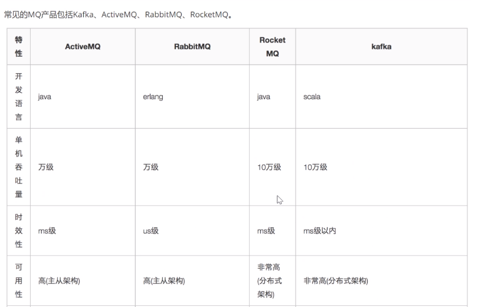
    
##RocketMq

####1.名词解析

######1.1NameServer:
    nameServer的主要功能是为整个MQ集群提供服务协调和治理,具体就是记录维护Topic,Borker的信息,及监控Broker的运行状态.为Client提供路由能力(具体实现和ZK有区别,NameServer是没有Leader和Follower区别的,不进行数据同步,通过Broker轮询修改信息)
    
    NameServer是一个几乎无状态的节点,可集群部署,节点之间无任何信息同步
    
    Broker部署相对复杂,Broker分为Master和Slave,一个Master对应多个Slave,但是一个Slave只能对应一个Master,Master与Slave的对应关系通过指定相同的BrokerName,不同的BrokerId来定义,BrokerId为0的标识Master,非0标识Slave.Master可以部署多个.每个Broker与NameServer集群中的所有结点建立长连接,定时注册Topic信息到所有NameServer
    
    Producer与NameServer集群中的其中一个节点(随机选择)建立长连接,定期从Name Server取Topic路由信息,并向提供Topic服务的Master建立长连接,且定时向Master发送心跳,Producer完全无状态,可集群部署
    
    Consumer与Name Server集群中的其中一个节点(随机选择)建立长连接,定期从Name Server取Topic路由信息,并向提供Topic服务的Master,Slave建立长连接,且定时向Master和Slave发送心跳.Consumer既可以从Master订阅消息,也可以从Slave订阅消息,订阅规则由Broker配置决定

######1.2Topic:
    一个生产者可以发送消息给一个或多个Topic,一个消费者可以订阅一个或多个Topic消息

#####1.3Message Queue:
    相当于消息的分区,用于并行发送和接收消息

######1.4Broker:
    Master与Slave之间的同步既可以同步也可以异步
    
    
    
####2.linux环境双主双从集群搭建

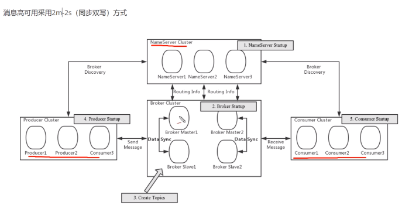
1. 启动NameServer,NameServer起来监听端口,等待Broker,Producer,Consumer连接,相当于一个控制中心
2. Broker启动,跟所有的NameServer保持连接,定时发送心跳包,心跳包中包含当前Broker信息(IP+端口等)以及存储所有Topic信息,注册成功后,NameServer集群中就有了Topic跟Broker的映射关系
3. 消息收发前,先创建topic,创建Topic时需要指定该Topic要存储在那些Broker上,也可以在发送消息时自动创建Topic
4. Producer发送消息,启动时先跟NameServer集群中的其中一台建立长连接,并从NameServer中获取当前发送的Topic存在那些Broker上,轮询从队列列表中选择一个队列,然后与队列所在的Broker建立长连接从而向Broker发送消息
5. Consumer跟Producer类似,跟其中一台NameServer建立长连接,获取当前订阅Topic存在哪些Broker上,然后直接跟Broker建立连接通道,开始消费消息

服务器环境

| 序号 | ip              | 角色                    | 架构模式       |
| ---- | --------------- | ----------------------- | -------------- |
| 1    | 192.168.5.62    | nameserver\brokerserver | Master1\Slave2 |
| 2    | 192.168.5.63    | nameserver\brokerserver | Master2\Slave1 |

######2.1下载
    wget https://mirrors.tuna.tsinghua.edu.cn/apache/rocketmq/4.7.0/rocketmq-all-4.7.0-bin-release.zip**](https://mirrors.tuna.tsinghua.edu.cn/apache/rocketmq/4.7.0/rocketmq-all-4.7.0-bin-release.zip

######2.2解压并重命名
    unzip  rocketmq-all-4.7.0-bin-release.zip
    mv rocketmq-all-4.7.0-bin-release  rocketmq

######2.3删除压缩包
    rm -rf  rocketmq-all-4.7.0-bin-release.zip

######2.4移动到指定目录
    mv  rocketmq-all-4.7.0-bin-release  /usr/local/rocketmq/ 
    
######2.5修改JVM内存(虚拟机启动时)    
    vim runserver.sh    
    vim runbroker.sh
    
######2.6Host添加信息
    vim /etc/hosts
    
    #nameserver
    
    192.168.5.63 rocketmq-nameserver1
    
    192.168.5.62 rocketmq-nameserver2
    
    #broker
    
    192.168.5.63 rocketmq-master1
    
    192.168.5.63 rocketmq-slave2
    
    192.168.5.62 rocketmq-master2
    
    192.168.5.62 rocketmq-slave1      
 
######2.7重启网卡
    
    systemctl restart network

######2.8关闭防火墙
    
    systemctl stop firewalld.service
    
    #查看防火墙状态
    
    firewall-cmd --state
    
    #禁止防火墙开机启动
    
    systemctl disable firewalld.service
          
######2.9配置环境变量(非必须,设置后可在任何目录执行mq的shutdown命令)

    vim /etc/profile
    
    #set rocketmq
    
    ROCKETMQ_HOME=/usr/local/rocketmq/rocketmq
    PATH=$PATH:$ROCKETMQ_HOME/bin
    export ROCKETMQ_HOME PATH
    
    
    source /etc/profile
######2.10配置消息存储的路径
    
    mkdir /usr/local/rocketmq/store
    
    mkdir /usr/local/rocketmq/store/commitlog
    
    mkdir /usr/local/rocketmq/store/consumequeue
    
    mkdir /usr/local/rocketmq/store/index
    
######2.11修改配置文件

    /usr/local/rocketmq/rocketmq/conf/2m-2s-sync
    
    #所属集群的名字
    brokerClusterName=rocketmq-cluster
    #broker名字 主义此处不同的配置文件填写的不一样
    brokerName=broker-a
    #0代表master  >0代表slave
    brokerId=0
    #nameServer的地址,用;分割  对应hosts文件中的配置
    namesrvAddr=rocketmq-nameserver1:9876;rocketmq-nameserver2:9876
    #在发送消息时,自动创建服务器不存在的topic,默认创建的队列数
    defaultTopicQueueNums=4
    #是否允许Broker自动创建Topic,建议线下开启,线上关闭
    autoCreateTopicEnable=true
    #是否允许Broker自动创建订阅组,建议线下开启,线上关闭
    autoCreateSubscriptionGroup=true
    #Broker对外服务的监听端口
    listenPort=10911
    #删除文件时间点,默认凌晨4点
    deleteWhen=04
    #文件保留时间,默认48小时
    fileReservedTime=120
    #commitLog每个文件的大小默认为1G
    mapedFileSizeCommitLog=1073741824
    #ConsumeQueue每个文件默认存30万条,根据业务情况调整
    mapedFileSizeConsumeQueue=300000
    #检测物理文件磁盘空间
    diskMaxUsedSpaceRatio=88
    #消息存储路径
    storePathRootDir=/usr/local/rocketmq/store
    #commitLog存储路径
    storePathCommitLog=/usr/local/rocketmq/commitLog
    #消费队列存储路径
    storePathConsumeQueue=/usr/local/rocketmq/store/consumequeue
    #消息索引存储路径
    stroeCheckpoint=/usr/local/rocketmq/store/index
    #checkPoint 文件存储路径
    storeCheckPoint=/usr/local/rocketmq/store/checkpoint
    #abort 文件存储路径
    abortFile=/usr/local/rocketmq/store/abort
    #限制的消息大小
    maxMessageSize=65536
    #broker的角色 
    #ASYNC_MASTER  异步复制Master    消息到达master,会立即给producer响应,然后复制消息到slave
    #SYNC_MASTER   同步双写Master    消息到达master后,会先复制到slave,然后再给producer响应
    
    #SLAVE
    
    brokerRole=SYNC_MASTER
    #刷盘方式
    #ASYNC_FLUSH    异步刷盘
    #SYNC_FLUSH     同步刷盘
    flushDiskType=SYNC_FLUSH
    
    #允许broker自动创建topic
    
    autoCreateTopicEnable=true
注意不同节点需要修改配置

    ip                      文件                          内容
    192.168.5.62            broker-a.properties           brokerName=broker-a
                                                          brokerId=0    
                                                          brokerRole=SYNC_MASTER
                                                          listenPort=10911
    ----------------------------------------------------------------------------------
    192.168.5.62            broker-b-s.properties         brokerName=broker-b
                                                          brokerId=1
                                                          brokerRole=SLAVE
                                                          listenPort=11011    
    ----------------------------------------------------------------------------------
    192.168.5.63           broker-b.properties            brokerName=broker-B
                                                          brokerId=0
                                                          brokerRole=SYNC_MASTER
                                                          listenPort=10911
    ----------------------------------------------------------------------------------
    192.168.5.63           broker-a-s.properties          brokerName=broker-a
                                                          brokerId=1
                                                          brokerRole=SLAVE
                                                          listenPort=11011      
    ----------------------------------------------------------------------------------                                                                                                                                                                           
        
######2.12编辑启动脚本文件中jvm参数(VMWARE虚拟机中需要设置)
    vim   /usr/local/rocketmq/rocketmq/bin/runbroker.sh
    
    JAVA_OPT="${JAVA_OPT} -server -Xms256m -Xmx256m -Xmn128m"
    
    vim /usr/local/rocketmq/rocketmq/bin/runserver.sh 
    
    JAVA_OPT="${JAVA_OPT} -server -Xms256m -Xmx256m -Xmn128m -XX:MetaspaceSize=128m -XX:MaxMetaspaceSize=320m"
    
    > 注意:可能出现jvm启动内存不足情况,需要根据实际情况调整  
    
######2.13启动nameServer集群
    nohup sh mqnamesrv &
######2.14启动broker集群
    
    通过指定不同的启动配置文件
    
    cd /usr/local/rocketmq/rocketmq/bin
    
    -c : 指定配置文件
    
    & : 后台启动    
192.168.5.62服务器
    
    - master1
    
      nohup sh mqbroker -c /usr/local/rocketmq/rocketmq/conf/2m-2s-sync/broker-a.properties &
    
    - slave2
    
      nohup sh mqbroker -c /usr/local/rocketmq/rocketmq/conf/2m-2s-sync/broker-b-s.properties &
  192.168.5.63服务器  
     - master2
     
       nohup sh mqbroker -c /usr/local/rocketmq/rocketmq/conf/2m-2s-sync/broker-b.properties &
     
     - slave1.
     
       nohup sh mqbroker -c /usr/local/rocketmq/rocketmq/conf/2m-2s-sync/broker-a-s.properties & 

####3.rocketmq-console管理工具
    
    下载地址:https://github.com/apache/rocketmq-externals 
    
    修改配置文件
    
    rocketmq.config.namesrvAddr=192.168.5.62:9876;192.168.5.63:9876
    
    打包成jar 上传到/usr/soft目录下

####4应用          
######4.1依赖
        <dependencies>
    
            <dependency>
                <groupId>org.apache.rocketmq</groupId>
                <artifactId>rocketmq-client</artifactId>
                <version>4.4.0</version>
            </dependency>
    
            <dependency>
                <groupId>org.projectlombok</groupId>
                <artifactId>lombok</artifactId>
                <version>1.18.8</version>
                <scope>provided</scope>
            </dependency>
    
            <!-- springboot web -->
            <dependency>
                <groupId>org.springframework.boot</groupId>
                <artifactId>spring-boot-starter-web</artifactId>
            </dependency>
    
            <dependency>
                <groupId>org.springframework.boot</groupId>
                <artifactId>spring-boot-starter-test</artifactId>
                <scope>test</scope>
            </dependency>
            <dependency>
                <groupId>junit</groupId>
                <artifactId>junit</artifactId>
            </dependency>
    
            <dependency>
                <groupId>junit</groupId>
                <artifactId>junit</artifactId>
                <version>4.12</version>
            </dependency>
            <dependency>
                <groupId>org.springframework</groupId>
                <artifactId>spring-test</artifactId>
            </dependency>
            <dependency>
                <groupId>org.springframework.boot</groupId>
                <artifactId>spring-boot-test</artifactId>
            </dependency>
            <dependency>
                <groupId>org.apache.rocketmq</groupId>
                <artifactId>rocketmq-spring-boot-starter</artifactId>
                <version>2.0.3</version>
            </dependency>
        </dependencies>

######4.2消息发送流程
    1. 创建消息生产者producer,并指定生产者组名
    2. 指定NameServer地址
    3. 启动producer
    4. 创建消息对象,指定主题Topic,tag和消息体
    5. 发送消息
    6. 关闭生产者producer

######4.3消息消费者步骤分析
    1. 创建消费者Consumer,指定消费者组名
    2. 指定NameServer地址
    3. 订阅主题Topic和Tag
    4. 设置回调函数,处理消息
    5. 启动消费者consumer
######4.4发送消息类型
    1.同步消息
    2.异步消息
    3.单向消息
    4.顺序消息
    5.延时消息
    6.批量发送消息
    7.事务消息
######4.5消息的消费模式
    1.负载均衡模式(默认)
    2.广播模式
                    
####5.消息存储(消息的持久化)
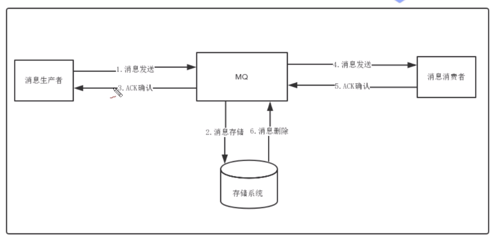
######5.1存储介质
    - 关系型数据库DB:ActiveMQ默认采用KahaDB做消息存储
    
    - 文件系统:RocketMQ/Kafka/RabbbitMQ均采用的是消息刷盘至所部署虚拟机/物理机的
    文件系统来做持久化(刷盘一般可分为异步刷盘和同步刷盘两种模式).
    消息刷盘为消息存储提供了一种高效率,高可靠性和高性能的数据持久化方式.
    除非部署MQ机器本身或本地磁盘挂了,否则一般是不会出现无法持久化的故障问题
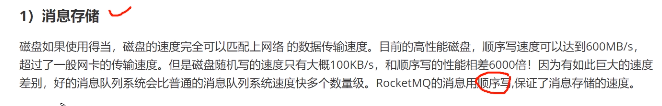

######5.2消息传输

######5.3消息的存储结构
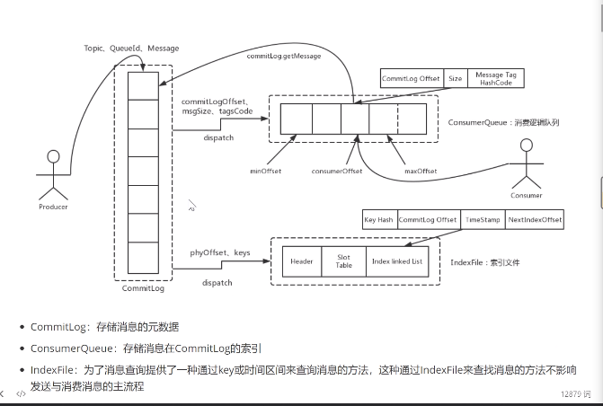

######5.4刷盘机制
    1. 同步刷盘:mq将消息写入到磁盘中之后才会向producer返回成功状态
    2. 异步刷盘:在返回成功状态时,消息只是被mq写入到内存中,写操作的返回快,
    吞吐量大.当内存中消息积累到一定程度时,统一触发写磁盘操作.
    
######5.5配置方式
    #刷盘方式
    #ASYNC_FLUSH    异步刷盘
    #SYNC_FLUSH     同步刷盘
    flushDiskType=SYNC_FLUSH

####6.高可用性机制

######6.1消息消费高可用
   
 
######6.2消息发送高可用
  

######6.3消息主从配置
    - 同步复制:消息在向master和slave均写成功后才会向producer返回成功状态
    - 异步复制:消息只要向master写成功之后即向producer返回成功状态,如果此时master故障,则存在消息丢失的问题

######6.4配置
    #ASYNC_MASTER  异步复制Master    消息到达master,会立即给producer响应,然后复制消息到slave
    #SYNC_MASTER   同步双写Master    消息到达master后,会先复制到slave,然后再给producer响应
    #SLAVE
    brokerRole=SYNC_MASTER
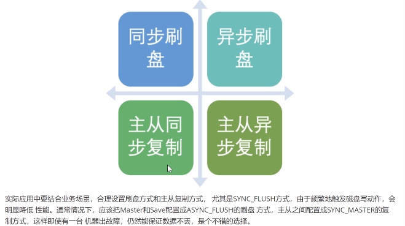  

####7.负载均衡

######7.1producer负载均衡
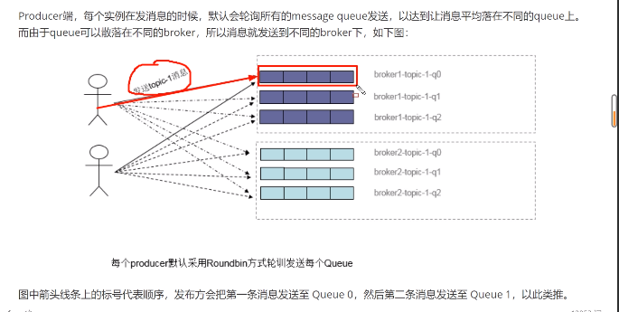  

######7.2consumer负载均衡
- 集群模式
- 广播模式

####8.消息重试
    顺序消息的重试    
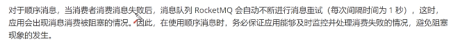  

    无序消息的重试
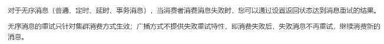  
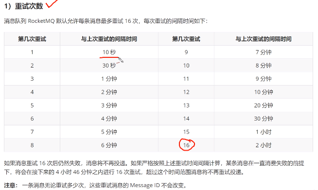  
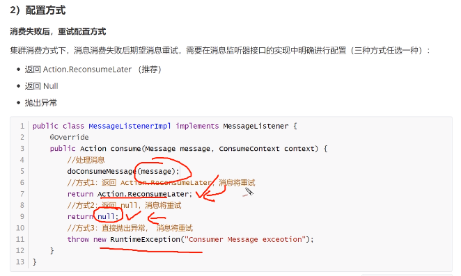  
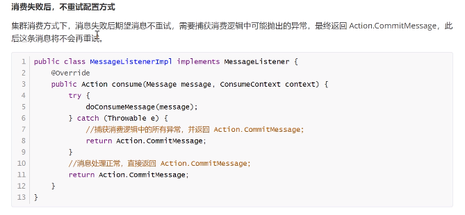

####9.死信队列
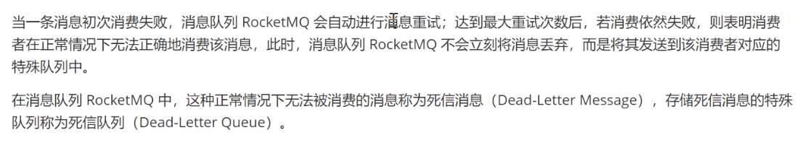
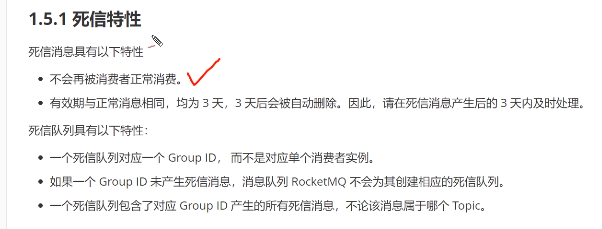

####10.消息幂等性
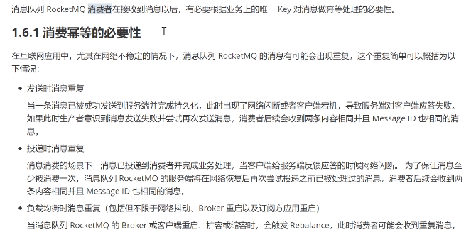
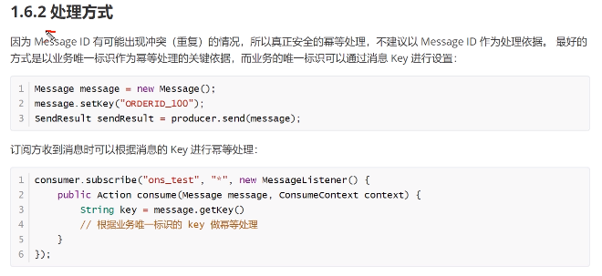

  
    
           	 

    
  
  

    
                    